# triage-router

*Price the frontier before you buy the LLM.*

> 先把便宜档位的能力边界量清楚，再决定这一笔 LLM 的钱值不值得花。

[](https://github.com/LucisZhang/triage-router/actions/workflows/ci.yml)

## Why this exists · 为什么做

`triage-router` builds a three-tier consumer-complaint triage system — TF-IDF plus a
calibrated linear model (Tier A), fine-tuned transformers (Tier B), Claude models
through OpenRouter (Tier C) — and then asks which routing policy is actually worth
buying under an explicit business cost model. The deliverable is a confidence-cascade
router whose escalation threshold is fitted on the calibration split only, plus an
append-only run log, per-call API receipts, and a static demo that runs the deployment
model in the browser. Every claim is bound to frozen temporal splits, paired bootstrap
intervals, and a gate that refuses to certify anything whose interval spans zero.

> 这个仓库把消费投诉分流做成三层系统：Tier A 是 TF-IDF + 校准线性模型，Tier B 是微调 transformer，Tier C 走 OpenRouter 调用 Claude。真正的问题不是哪一层最准，而是在一套写明参数的业务成本模型下，哪条路由策略值得买。交付物是一个 confidence-cascade router，escalation 阈值只在 calibration split 上拟合；配套还有 append-only 的 run log、逐次调用的 API receipts，以及把部署模型放进浏览器跑的静态 demo。所有结论都绑定 frozen temporal splits 与 paired bootstrap CI，区间跨零的一律不发证。

The frozen snapshot is the CFPB Consumer Complaint Database pinned by SHA-256
`b4d1eac8ef9f2e7710224848d321f355c480ff95baa742a2f6d1e3c704705600`, downloaded
2026-08-05. <!-- src: SNAPSHOT_MANIFEST.yaml --> Splits are materialized deterministically:
TRAIN 300,000 rows (2015-07-01 → 2021-12-31), CAL 86,972 (2022-H1), TEST-IID 104,443
(2022-H2), and four 20,000-row yearly drift slices through 2026-H1.
<!-- src: docs/DATASHEET.md -->

> 数据快照是 CFPB Consumer Complaint Database，按 SHA-256 `b4d1eac8ef9f2e7710224848d321f355c480ff95baa742a2f6d1e3c704705600` 固定，下载日期 2026-08-05。<!-- src: SNAPSHOT_MANIFEST.yaml --> 切分确定性生成：TRAIN 300,000 行（2015-07-01 → 2021-12-31）、CAL 86,972 行（2022-H1）、TEST-IID 104,443 行（2022-H2），外加四个 20,000 行的年度 drift 切片，覆盖到 2026-H1。<!-- src: docs/DATASHEET.md -->

## Quickstart · 快速开始

The claim chain can be resolved with no dataset, no checkpoint, no GPU, and no API key:

> 复核 claim chain 不需要 dataset、checkpoint、GPU，也不需要 API key：

```bash
git clone https://github.com/LucisZhang/triage-router.git
cd triage-router
uv sync --frozen --extra charts --extra tierc
uv run ruff check
uv run pytest -q
uv run python -m triage_lab.reproduce_headline --plan
```

`--plan` resolves the whole headline derivation graph — 11 runs and 27 gated outputs —
from the committed derivation records with no `data/` directory present.
<!-- src: .github/workflows/ci.yml --> It reads only files already in the repository: it
starts no model, contacts no OpenRouter endpoint, and spends nothing. This is the exact
entry point the CI workflow runs on every push and pull request.
<!-- src: .github/workflows/ci.yml -->

> `--plan` 只依赖已提交的 derivation records，就能把整条 headline 推导图解析出来 —— 11 个 run、27 个受门禁保护的输出 —— 全程不需要 `data/` 目录。<!-- src: .github/workflows/ci.yml --> 它只读仓库里已有的文件，不启动模型、不访问 OpenRouter、不产生任何花费。CI 在每次 push 与 pull request 上跑的就是这条命令。<!-- src: .github/workflows/ci.yml -->

The full re-derivation is honest about what it costs:

> 完整重算的代价则写在明面上：

```bash
make reproduce-headline
```

The recorded end-to-end run took 46,360 s ≈ 12 h 53 m of wall clock on one
Apple-silicon laptop: 418 s for data materialization, 45,829 s for predictions (the
three ModernBERT seed evaluations dominate), and roughly 114 s for derivation plus demo
build. It finished with the split byte-identity gate green, 11/11 chain artifacts
metric-verified at 1e-9, 27/27 committed demo outputs byte-identical under SHA-256, and
`results/runs.jsonl` untouched at 55 records. It added $0 of API spend, because Tier C
replays from committed receipts rather than re-calling any model.
<!-- src: STATUS.md -->

> 一次完整的端到端记录：Apple-silicon 笔记本上 46,360 s ≈ 12 h 53 m —— 数据物化 418 s，预测 45,829 s（三个 ModernBERT seed 的评测占绝大部分），推导加 demo 构建约 114 s。收尾结果是 split 字节一致性门禁通过、11/11 条链上产物在 1e-9 精度上指标复现、27/27 个已提交 demo 输出在 SHA-256 下逐字节一致、`results/runs.jsonl` 保持 55 条不变。API 花费为 $0，因为 Tier C 是从已提交的 receipts 回放，不重新调用模型。<!-- src: STATUS.md -->

`make reproduce-headline` does require the frozen snapshot and the un-gitted Tier B
checkpoints. Preflight hashes them against each run record's declared checkpoint SHA-256
and fails in about 2 s with the runbook path when they are absent.
<!-- src: STATUS.md -->

> `make reproduce-headline` 确实需要 frozen snapshot 和未入库的 Tier B checkpoints。preflight 会按每条 run record 里声明的 checkpoint SHA-256 校验，缺失时约 2 s 内失败并给出 runbook 路径。<!-- src: STATUS.md -->

## Headline · 核心结果

**The certified router is `a_to_b`: a Tier A confidence gate in front of DistilBERT, not
in front of an LLM.** On the full frozen TEST-IID slice (n=104,443) it lowers expected
cost per 1,000 complaints by **$120.58 [$110.24, $131.04]** against the all-linear
policy while raising system macro-F1 by **+0.0370 [+0.0337, +0.0402]**. Both paired
95% bootstrap intervals exclude zero, which is what the gate requires before it will
call anything certified. Point costs are **$812.83/1k** for the router versus
**$933.41/1k** for all-linear, a **12.9183% [11.8266%, 13.9986%]** reduction, and
McNemar over the 104,443 machine-answered rows gives b=5,161 / c=3,062,
p=1.0169207274353265e-119. <!-- src: results/frontier/frontier__opv2__cost-2c969255.json -->

> 拿到认证的路由是 `a_to_b`：Tier A 置信门控接的是 DistilBERT，不是 LLM。在完整的 frozen TEST-IID 切片（n=104,443）上，相对 all-linear 策略，每 1,000 件投诉的期望成本下降 $120.58 [$110.24, $131.04]，同时 system macro-F1 提升 +0.0370 [+0.0337, +0.0402]。两条 paired 95% bootstrap 区间都不含零 —— 这正是发证门槛的硬性要求。成本点估计为 router $812.83/1k、all-linear $933.41/1k，降幅 12.9183% [11.8266%, 13.9986%]；在 104,443 条机器作答行上做 McNemar，b=5,161 / c=3,062，p=1.0169207274353265e-119。<!-- src: results/frontier/frontier__opv2__cost-2c969255.json -->

Every interval on this page is a percentile bootstrap over 1,000 resamples at fixed seed
20260805; for a comparison, one shared index draw per replicate is applied to both
systems, so cost and macro-F1 deltas are read off the same resamples.
<!-- src: results/frontier/frontier__opv2__cost-2c969255.json -->

> 本页所有区间都是 1,000 次重采样、固定 seed 20260805 的 percentile bootstrap；做对比时每个 replicate 用同一组索引作用于两个系统，因此成本与 macro-F1 的 delta 读自完全相同的重采样。<!-- src: results/frontier/frontier__opv2__cost-2c969255.json -->

What the headline is and is not: "cost per 1,000" is the **business** cost
`c_misroute × P(error) + api + c_human × P(human)`, not API spend. Its two dollar
parameters — `c_misroute_usd: 6.00` and `c_human_usd: 2.50` — are declared ESTIMATED
business defaults, not measurements, and Tier A and Tier B compute prices are ESTIMATED
amortized figures. Only Tier C's API term is MEASURED, from per-call token receipts.
The headline therefore certifies a policy ordering **under this stated cost model**; it
does not measure a real operator's dollars. <!-- src: configs/cost_model_v2.yaml -->

> 这条 headline 的边界要说清楚：这里的 "cost per 1,000" 是业务成本 `c_misroute × P(error) + api + c_human × P(human)`，不是 API 支出。其中两个美元参数 `c_misroute_usd: 6.00` 与 `c_human_usd: 2.50` 明确标注为 ESTIMATED 业务默认值，不是测量结果；Tier A 与 Tier B 的算力单价同样是 ESTIMATED 的摊销估算。只有 Tier C 的 API 项是 MEASURED，来自逐次调用的 token receipts。所以它认证的是这套成本模型下的策略排序，而不是某个真实运营方的账单。<!-- src: configs/cost_model_v2.yaml -->

Single-tier TEST-IID points, each quoted at its own measured n:

> 各单层在 TEST-IID 上的结果，n 按各自实际测量规模标注：

| Point | TEST-IID macro-F1 [95% CI] | n | Measured API cost / 1k [95% CI] | p50 latency |
|---|---:|---:|---:|---:|
| Tier A — TF-IDF word+char → LogReg, isotonic | 0.7605 [0.7564, 0.7643] | 104,443 | charged $0 (estimated, amortized) | — |
| Tier A — word-only sensitivity arm | 0.7676 [0.7637, 0.7717] | 104,443 | charged $0 (estimated, amortized) | — |
| Tier B1 — ModernBERT-base, seeds a/b/c | 0.7878 / 0.7878 / 0.7863 | 104,443 | $0.0202 (estimated, amortized) | — |
| **Tier B2 — DistilBERT, deployment point** | **0.7950 [0.7909, 0.7988]** | 104,443 | $0.0056 (estimated, amortized) | — |
| Tier C — Claude Haiku 4.5, zero-shot | 0.7697 [0.7499, 0.7886] | 5,000 | $1.3150172 [1.30664824, 1.323680365] | 1.38 s |
| Tier C — Claude Sonnet 5, zero-shot | 0.7418 [0.7015, 0.7730] | 1,500 | $3.658716 [3.6158214333, 3.70207] | 3.17 s |

<!-- src: results/runs.jsonl -->
<!-- src: results/cost_model/70a1b0c40e8e042a336ea595588dfc1038806bdf68f2d056587302d232a39f1e.json -->
<!-- src: results/cost_model/e1503146b74d90cb91d521e43382710715bdb3ca20ff720b412465480bf6c48a.json -->
<!-- src: results/tier_c_raw/tier_c_haiku_zeroshot_test_iid/20260807T004109Z/calls.jsonl -->
<!-- src: results/tier_c_raw/tier_c_sonnet_zeroshot_test_iid/20260807T015725Z/calls.jsonl -->
<!-- src: configs/cost_model_v2.yaml -->

The Tier B1 and Tier B2 per-1k API figures are amortized estimates, not invoices: a
measured harness throughput multiplied by an estimated $0.50 per GPU-hour rate. The
logged wall clock covers the whole harness run rather than pure inference, and MPS-measured
throughput is priced at a rented-A6000 rate; both distortions push the figure up, which
is the conservative direction for a tier whose cost advantage is the claim.
<!-- src: configs/cost_model_v2.yaml -->

> Tier B1 与 Tier B2 的每千件 API 数字是摊销估算而非账单：实测的 harness 吞吐乘以估计的 $0.50 每 GPU-hour 单价。记录的 wall clock 覆盖整个 harness 运行而非纯推理，而 MPS 上测得的吞吐却按租用 A6000 计价；两处偏差都把数字推高，对一个以成本优势为卖点的层级来说，这个方向是保守的。<!-- src: configs/cost_model_v2.yaml -->

The pre-registered surprise is retained: the 66M-parameter DistilBERT beats all three
ModernBERT-base seeds under the frozen training protocol. Paired macro-F1 deltas of B1
minus B2 are −0.0072 [−0.0106, −0.0038], −0.0072 [−0.0106, −0.0040] and −0.0088
[−0.0119, −0.0054], every interval excluding zero, with McNemar p = 6.30593364159821e-08,
2.4119632995334786e-09 and 7.091889282195299e-11 on n=104,443.
<!-- src: results/tier_b_compare/summary.json --> This is a protocol-scoped result: one
seed for B2 against three for B1, one shared training recipe, no hyperparameter search
per architecture. It does not establish that DistilBERT is generally stronger than
ModernBERT-base. <!-- src: results/tier_b_compare/summary.json -->

> 预登记的意外结论保留下来：在 frozen 训练协议下，66M 参数的 DistilBERT 打赢了三个 ModernBERT-base seed。B1 减 B2 的 paired macro-F1 delta 分别是 −0.0072 [−0.0106, −0.0038]、−0.0072 [−0.0106, −0.0040]、−0.0088 [−0.0119, −0.0054]，区间全部不含零，n=104,443 上 McNemar p 依次为 6.30593364159821e-08、2.4119632995334786e-09、7.091889282195299e-11。<!-- src: results/tier_b_compare/summary.json --> 但这是协议内结论：B2 只有一个 seed，B1 有三个，训练配方共用一套，也没有按架构分别调参。它不能推出 DistilBERT 总体强于 ModernBERT-base。<!-- src: results/tier_b_compare/summary.json -->

Raw records: [`results/runs.jsonl`](results/runs.jsonl) (55 run records with metrics,
CIs, git SHA, snapshot hash, config hash, wall clock and cost),
[`results/frontier/`](results/frontier/) (claim gates),
[`results/tier_c_raw/`](results/tier_c_raw/) (per-call API receipts).

> 原始记录：[`results/runs.jsonl`](results/runs.jsonl)（55 条 run record，含指标、CI、git SHA、snapshot hash、config hash、wall clock 与成本）、[`results/frontier/`](results/frontier/)（claim 门禁）、[`results/tier_c_raw/`](results/tier_c_raw/)（逐次调用的 API receipts）。

## What shipped · 交付内容

```mermaid
flowchart LR
  SNAP["Frozen CFPB snapshot<br/>sha256 b4d1eac8"] --> SPLITS["Dedup + taxonomy map<br/>TRAIN / CAL / TEST-IID / drift"]
  SPLITS --> TIERS["Tier A TF-IDF+LogReg · Tier B1/B2 fine-tune · Tier C Claude via OpenRouter"]
  TIERS --> RUNS["results/runs.jsonl<br/>55 run records + receipts"]
  RUNS --> COST["Business cost model v2<br/>c_misroute 6.00 · c_human 2.50"]
  COST --> TAU["CAL-only threshold sweep<br/>tau* = 0.6448830480864552"]
  TAU --> FRONTIER["Frontier claim gate<br/>paired bootstrap, CI vs zero"]
  FRONTIER --> DEMO["Static demo<br/>int8 ONNX in-browser"]
```



- An append-only run log of 55 records, each carrying metrics with bootstrap CIs, the
  git SHA, the snapshot hash, config and prompt hashes, wall clock, and recorded cost.
  <!-- src: results/runs.jsonl -->

> 一份 append-only 的 run log，共 55 条记录，每条都带 bootstrap CI 的指标、git SHA、snapshot hash、config 与 prompt hash、wall clock 和记录成本。<!-- src: results/runs.jsonl -->

- A versioned business cost model. `cost_model_v1.yaml` is retained unedited as the
  identity of every Phase 4 number reported before Tier B landed; `cost_model_v2.yaml`
  adds only Tier B pricing and keeps the two dollar parameters byte-identical, so any
  v1-versus-v2 difference on a Tier A or Tier C number would be a bug rather than a
  finding. Both files' raw bytes are hashed into every artifact derived from them.
  <!-- src: configs/cost_model_v2.yaml -->

> 一套带版本的业务成本模型。`cost_model_v1.yaml` 原封保留，代表 Tier B 落地之前所有 Phase 4 数字的身份；`cost_model_v2.yaml` 只新增 Tier B 定价，两个美元参数逐字节不变 —— 所以 Tier A 或 Tier C 的数字若在 v1 与 v2 之间出现差异，那是 bug，不是发现。两份文件的原始字节都被 hash 进由它们派生的每一件产物。<!-- src: configs/cost_model_v2.yaml -->

- A CAL-only threshold sweep and a router simulator covering `a_only`, `a_only_cnb`,
  `b1_only` × 3 seeds, `b2_only`, `c_only`, `a_to_human`, `a_to_b`,
  `a_to_c_parsefail_human`, `a_to_b_to_c` and `all_human`, with a dominance census that
  refuses to count `all_human` toward any dominance claim.
  <!-- src: results/frontier/frontier__opv2__cost-2c969255.json -->

> 只在 CAL 上做的阈值扫描，加上覆盖 `a_only`、`a_only_cnb`、3 个 seed 的 `b1_only`、`b2_only`、`c_only`、`a_to_human`、`a_to_b`、`a_to_c_parsefail_human`、`a_to_b_to_c` 与 `all_human` 的 router 模拟器；dominance census 明确拒绝把 `all_human` 计入任何 dominance 结论。<!-- src: results/frontier/frontier__opv2__cost-2c969255.json -->

- Committed per-call Tier C receipts for 28 runs under
  [`results/tier_c_raw/`](results/tier_c_raw/), each line recording prompt and completion
  tokens, computed cost, latency, provider, retries, finish reason and parse status.
  <!-- src: results/tier_c_raw/tier_c_haiku_zeroshot_test_iid/20260807T004109Z/calls.jsonl -->

> [`results/tier_c_raw/`](results/tier_c_raw/) 下提交了 28 个 run 的逐次调用 receipts，每行记录 prompt/completion token 数、计算成本、延迟、provider、重试次数、finish reason 与解析状态。<!-- src: results/tier_c_raw/tier_c_haiku_zeroshot_test_iid/20260807T004109Z/calls.jsonl -->

- A fully static demo in [`demo/`](demo/) that runs Tier A and the int8 ONNX Tier B2
  model in the browser with vendored onnxruntime-web, plus a committed agreement report
  gating the browser engines against the official artifacts. It is published by a GitHub
  Pages workflow. <!-- src: .github/workflows/pages.yml -->

> [`demo/`](demo/) 是完全静态的演示页，用 vendored 的 onnxruntime-web 在浏览器里跑 Tier A 与 int8 ONNX 的 Tier B2，并提交了一份 agreement report，用来把浏览器引擎与官方产物对齐校验。发布由 GitHub Pages workflow 完成。<!-- src: .github/workflows/pages.yml -->

- A dataset datasheet, a Tier B runbook, and a 2,377-line engineering log recording
  hypothesis, result and verdict for every experiment including the refuted ones.
  <!-- src: EXPERIMENT_LOG.md -->

> 一份数据集 datasheet、一份 Tier B runbook，以及 2,377 行的工程日志 —— 每个实验的假设、结果、判定都在其中，被推翻的也在。<!-- src: EXPERIMENT_LOG.md -->

## Routing frontier · 路由前沿

Measurement conditions first. Thresholds are fitted on the CAL split under the v2
operating point (`v2-isocal`), meaning τ is fitted on isotonic-calibrated CAL
confidences — the same calibration the deployment artifact applies — and then the
constant is shipped unchanged onto TEST. Realized coverage is reported as whatever it
turns out to be. Full-slice rows are n=104,443; paired-subset rows are n=5,000 and exist
because Tier C was only ever called on a subsample.
<!-- src: results/frontier/frontier__opv2__cost-2c969255.json -->

> 先说测量条件。阈值在 CAL 上按 v2 operating point（`v2-isocal`）拟合，即 τ 拟合在 isotonic 校准后的 CAL 置信度上 —— 与部署产物所用的校准一致 —— 随后常数原样搬到 TEST，realized coverage 是多少就报多少。full-slice 行 n=104,443；paired-subset 行 n=5,000，因为 Tier C 只在子样本上调用过。<!-- src: results/frontier/frontier__opv2__cost-2c969255.json -->

| Policy | Set | Tier A coverage | System macro-F1 | Expected cost / 1k [95% CI] | Verdict |
|---|---|---:|---:|---:|---|
| `a_only` | full_test_iid | 1.0000 | 0.7605 | 933.41 [920.94, 946.45] | baseline |
| `b1_only_sa` | full_test_iid | — | 0.7878 | 862.60 [850.30, 875.42] | dominated by `a_to_b` |
| `b2_only` | full_test_iid | — | 0.7950 | 834.32 [822.14, 846.68] | certified vs `a_only` |
| `a_to_human` | full_test_iid | 0.9053 | 0.8475 | 872.81 [861.64, 883.88] | certified vs `a_only`; human-credited |
| **`a_to_b`** | full_test_iid | 0.7038 | 0.7976 | **812.83 [800.94, 824.90]** | **certified vs `a_only` and vs `b2_only`** |
| `a_to_c_parsefail_human` | paired_subset | 0.9710 | — | 908.44 | not established (both axes span zero vs `c_only`) |
| `a_to_b_to_c` | paired_subset | 0.4548 | — | — | certified vs `c_only` and vs `a_only`; not established vs `b2_only` |
| `all_human` | — | 0.0000 | — | 2500.00 | excluded from dominance counting by design |

<!-- src: results/frontier/frontier__opv2__cost-2c969255.json -->
<!-- src: EXPERIMENT_LOG.md -->

`a_to_b`'s second certification is against Tier B2 alone: adding the Tier A gate in
front of DistilBERT cuts **$21.49/1k [$16.66, $26.14]** and raises system macro-F1 by
**+0.0025 [+0.0010, +0.0042]**, both intervals excluding zero on n=104,443. The gate is
worth roughly four times less in front of B2 than in front of A, and the honest reading
is that most of the win comes from routing to cheap capacity rather than from the gate
itself. <!-- src: results/frontier/frontier__opv2__cost-2c969255.json -->

> `a_to_b` 的第二张证书是相对 Tier B2 单层：在 DistilBERT 前面加上 Tier A 门控，每千件成本再降 $21.49/1k [$16.66, $26.14]，system macro-F1 提升 +0.0025 [+0.0010, +0.0042]，n=104,443 上两个区间都不含零。但门控放在 B2 前面的价值大约只有放在 A 前面的四分之一 —— 老实说，收益的大头来自把流量导向便宜算力，而不是门控本身。<!-- src: results/frontier/frontier__opv2__cost-2c969255.json -->

An adverse result is retained rather than dropped. Against the `a_to_human` incumbent,
`a_to_b` is **significantly worse** on system macro-F1: −0.0499 [−0.0534, −0.0465] on
n=104,443, so no `claim_4_vs_incumbent_router` claim can be made. That comparison is not
neutral, though: `accuracy_system` and `macro_f1_system` credit every human-routed row as
correct, matching the cost model's P(error|human)=0 assumption, which flatters any policy
with a human arm. `a_to_human` routes 9,886 of 104,443 rows to the human queue; `a_to_b`
routes zero, so its system and machine views coincide and no human assumption is
load-bearing for it. <!-- src: results/frontier/frontier__opv2__cost-2c969255.json -->

> 一个不利结果照样留在正文里。相对现役的 `a_to_human`，`a_to_b` 在 system macro-F1 上显著更差：n=104,443 上 −0.0499 [−0.0534, −0.0465]，因此 `claim_4_vs_incumbent_router` 不成立。但这个对比本身并不中立：`accuracy_system` 与 `macro_f1_system` 把所有转人工的行一律记为正确，对应成本模型里 P(error|human)=0 的假设，天然偏袒带人工分支的策略。`a_to_human` 把 104,443 行中的 9,886 行送去人工队列，`a_to_b` 送 0 行 —— 后者的 system 视图与 machine 视图重合，不依赖任何人工假设。<!-- src: results/frontier/frontier__opv2__cost-2c969255.json -->

The all-LLM routing leg is **NOT ESTABLISHED**. On the n=5,000 paired subset,
`a_to_c_parsefail_human` versus `c_only` gives system accuracy +0.0012 [−0.0068,
+0.0100] and a percent cost reduction of +0.9247% [−4.4470%, +6.3482%]; versus `a_only`
its cost delta is favorable at −$22.76/1k [−$41.96, −$2.37] but its macro-F1 delta
+0.0070 [−0.0027, +0.0165] spans zero. Both are reported as directional only, never as
claims. <!-- src: results/frontier/frontier__opv2__cost-2c969255.json -->

> 全 LLM 那条路由腿判定为 NOT ESTABLISHED。在 n=5,000 的 paired subset 上，`a_to_c_parsefail_human` 对 `c_only` 的 system accuracy 为 +0.0012 [−0.0068, +0.0100]，成本降幅 +0.9247% [−4.4470%, +6.3482%]；对 `a_only` 虽然成本 delta 有利，为 −$22.76/1k [−$41.96, −$2.37]，但 macro-F1 delta +0.0070 [−0.0027, +0.0165] 跨零。两者都只作为方向性观察报告，不作为结论。<!-- src: results/frontier/frontier__opv2__cost-2c969255.json -->

The three-tier `a_to_b_to_c` cascade does certify on the same n=5,000 subset — +0.0216
[+0.0138, +0.0294] system accuracy and 14.27% [9.22%, 18.97%] cost reduction versus
`c_only`, and −$145.10/1k [−$193.08, −$93.50] with +0.0333 [+0.0155, +0.0485] macro-F1
versus `a_only` — but it does **not** certify against `b2_only`: cost −$25.10 [−$53.94,
+$4.93] and macro-F1 +0.0053 [−0.0057, +0.0165], both spanning zero. At n=5,000 the
three-tier cascade cannot be shown to beat simply running DistilBERT on everything.
<!-- src: results/frontier/frontier__opv2__cost-2c969255.json -->

> 三层级联 `a_to_b_to_c` 在同一个 n=5,000 子集上确实拿到证书 —— 对 `c_only` 的 system accuracy +0.0216 [+0.0138, +0.0294]、成本降幅 14.27% [9.22%, 18.97%]，对 `a_only` 成本 −$145.10/1k [−$193.08, −$93.50]、macro-F1 +0.0333 [+0.0155, +0.0485] —— 但对 `b2_only` 不成立：成本 −$25.10 [−$53.94, +$4.93]、macro-F1 +0.0053 [−0.0057, +0.0165]，双双跨零。在 n=5,000 的样本量下，无法证明三层级联优于"所有请求直接交给 DistilBERT"。<!-- src: results/frontier/frontier__opv2__cost-2c969255.json -->

The v1 threshold derivation is kept as a documented failure. Fitting τ on raw CAL
probabilities and shipping it into the deployment model's isotonic-compressed
probability space lost 5–16 points of realized coverage on TEST: `a_to_human` full-slice
went from a 0.8689 target to 0.8206 realized, and `a_to_c` from 0.7793 to 0.6224. The v2
alignment closed that gap roughly tenfold, to +0.0047 and +0.0110 residuals. Aligning the
calibration space is not the same as calibrating better — the aligned CAL rung's ECE
actually worsened from 0.0225 to 0.1024 — the point is only that τ now lives in the
space the deployed model speaks. <!-- src: EXPERIMENT_LOG.md -->

> v1 的阈值推导作为有据可查的失败保留下来。把 τ 拟合在原始 CAL 概率上、再搬进部署模型经 isotonic 压缩的概率空间，TEST 上损失了 5–16 个点的 realized coverage：`a_to_human` 全切片从目标 0.8689 掉到实际 0.8206，`a_to_c` 从 0.7793 掉到 0.6224。v2 的空间对齐把这个缺口收窄约十倍，残差分别为 +0.0047 与 +0.0110。需要说明的是，对齐校准空间不等于校准得更好 —— 对齐后的 CAL rung，ECE 反而从 0.0225 恶化到 0.1024 —— 它唯一的意义是让 τ 活在部署模型所使用的那个空间里。<!-- src: EXPERIMENT_LOG.md -->

## Distribution drift 2022-H2 → 2026-H1 · 分布漂移

Measurement conditions: models are trained on pre-2022 data and evaluated on frozen
yearly slices. Tier A and Tier B2 are scored on the full slice — 104,443 rows at 2022-H2
and 20,000 rows per drift year — while Tier C is a uniform-random subsample, 5,000 at
2022-H2 for Haiku and 1,500 elsewhere. The supports differ by tier and are **not
comparable as populations**; only within-tier trajectories are read across years.
<!-- src: results/drift/summary.json -->

> 测量条件：模型在 2022 年以前的数据上训练，在冻结的年度切片上评测。Tier A 与 Tier B2 用完整切片 —— 2022-H2 为 104,443 行，各 drift 年份为 20,000 行 —— 而 Tier C 是均匀随机子样本，Haiku 在 2022-H2 为 5,000，其余为 1,500。各层的样本支撑不同，作为总体不可直接比较；跨年份只读同一层内部的轨迹。<!-- src: results/drift/summary.json -->

| Tier | 2022-H2 | 2023 | 2024 | 2025 | 2026-H1 | n per drift slice |
|---|---:|---:|---:|---:|---:|---:|
| Tier A LogReg | 0.7605 | 0.7579 | 0.7478 | 0.7295 | 0.6656 | 20,000 |
| Tier B2 DistilBERT | 0.7950 | 0.7901 | 0.7738 | 0.7599 | 0.7262 | 20,000 |
| Tier C Haiku 4.5 | 0.7697 | 0.7357 | 0.7617 | 0.7639 | 0.7278 | 1,500 |
| Tier C Sonnet 5 | 0.7418 | 0.7544 | 0.7795 | 0.7634 | 0.7821 | 1,500 |

<!-- src: results/drift/summary.json -->

Interval widths differ by an order of magnitude across these rows and must be read before
the trend is: Tier A's 2026-H1 point is 0.6656 [0.6585, 0.6729] on 20,000 rows, while
Sonnet's is 0.7821 [0.7587, 0.8046] on 1,500. The repository contains no paired
Sonnet-versus-Haiku comparison on any drift slice, so no significance statement is made
about their difference at 2026-H1. <!-- src: results/drift/summary.json -->

> 这几行的区间宽度差了一个数量级，看趋势之前先看区间：Tier A 在 2026-H1 是 0.6656 [0.6585, 0.6729]，基于 20,000 行；Sonnet 是 0.7821 [0.7587, 0.8046]，基于 1,500 行。仓库里没有任何 drift 切片上的 Sonnet 对 Haiku 配对比较，因此不对二者在 2026-H1 的差距作显著性陈述。<!-- src: results/drift/summary.json -->

The decomposition splits degradation into a class-mix (prior) term and a within-class
term, using 2023 as the reference year and a bootstrap that resamples both slices under a
shared index stream. Against 2023, Tier A loses a total of **0.0924 [0.0802, 0.1042]**
macro-F1 by 2026-H1, of which **0.0420 [0.0385, 0.0454]** is prior shift — a prior share
of **0.4549 [0.3950, 0.5237]** — and **0.0503 [0.0385, 0.0625]** is within-class.
<!-- src: results/prior_shift/summary.json -->

> 这套分解把退化拆成 class-mix（prior）项与 within-class 项，参考年份取 2023，bootstrap 对两个切片用共享索引流重采样。相对 2023，Tier A 到 2026-H1 共损失 macro-F1 0.0924 [0.0802, 0.1042]，其中 prior shift 占 0.0420 [0.0385, 0.0454]，prior 份额为 0.4549 [0.3950, 0.5237]，within-class 占 0.0503 [0.0385, 0.0625]。<!-- src: results/prior_shift/summary.json -->

The single class `credit_reporting` carries most of it. Its Tier A F1 falls from 0.9000
at 2023 to 0.2147 at 2026-H1, while its slice prior collapses from 0.47225 to 0.02925
and its recall only falls from 0.9247 to 0.7692 — the F1 collapse is driven by precision
under a vanished class, not by the model forgetting how to recognize the text. The CFPB
credit-reporting product consolidation was announced 2023-04 and first observed in the
frozen snapshot at 2023-08, so the 2023 slice straddles the change rather than sitting
after it. <!-- src: results/prior_shift/tier_a__2026h1.json --><!-- src: results/drift/summary.json -->

> 绝大部分退化落在 `credit_reporting` 这一个类上。Tier A 对它的 F1 从 2023 年的 0.9000 掉到 2026-H1 的 0.2147，同期该类在切片中的占比从 0.47225 塌到 0.02925，而 recall 只从 0.9247 降到 0.7692 —— F1 的崩塌来自类目近乎消失后的 precision，而不是模型认不出文本了。CFPB 的 credit-reporting 产品合并于 2023-04 公布，在冻结快照中首次出现是 2023-08，所以 2023 切片是横跨这次变更的，而非位于其后。<!-- src: results/prior_shift/tier_a__2026h1.json --><!-- src: results/drift/summary.json -->

The "the fine-tuned transformer behaves like an LLM" hypothesis was tested and rejected.
Tier B2's within-class term at 2026-H1 is **+0.0336 [+0.0234, +0.0451]**, an interval
excluding zero, so B2 does take real within-class damage, unlike Sonnet, whose within
term is −0.0287 [−0.0711, +0.0111]. B2 is nonetheless significantly less damaged than
Tier A: the owner-requested paired test gives within(A) − within(B2) = **+0.0168
[+0.0058, +0.0276]**, robust across the path-q, Shapley and ANOVA decompositions.
<!-- src: results/prior_shift/summary.json -->
<!-- src: results/prior_shift/paired_within_tier_a_vs_tier_b2_2026h1.json -->

> "微调 transformer 的表现更像 LLM"这个假设经过检验并被否定。Tier B2 在 2026-H1 的 within-class 项为 +0.0336 [+0.0234, +0.0451]，区间不含零，说明 B2 确实吃到了实打实的 within-class 损伤；而 Sonnet 的 within 项是 −0.0287 [−0.0711, +0.0111]。不过 B2 受损确实显著小于 Tier A：按 owner 要求补做的配对检验给出 within(A) − within(B2) = +0.0168 [+0.0058, +0.0276]，在 path-q、Shapley 与 ANOVA 三种分解下都稳定。<!-- src: results/prior_shift/summary.json --><!-- src: results/prior_shift/paired_within_tier_a_vs_tier_b2_2026h1.json -->

Lexical novelty is ruled out as the driver. Token-level OOV against the fitted model
vocabulary rises only from **0.0054500697 [0.0054043962, 0.0054961684]** on TRAIN to
**0.0077259932 [0.0075068600, 0.0079625104]** at 2026-H1, and the TF-IDF centroid cosine
distance to TRAIN actually **falls** from 0.0926111044 [0.0908539813, 0.0951142416] at
2025 to 0.0814737164 [0.0801001196, 0.0832695481] at 2026-H1, with disjoint intervals.
The damage is class-mix and label-boundary movement, not new words.
<!-- src: results/oov/summary.json -->

> 词汇新颖度被排除在成因之外。相对已拟合的模型词表，token 级 OOV 只从 TRAIN 的 0.0054500697 [0.0054043962, 0.0054961684] 升到 2026-H1 的 0.0077259932 [0.0075068600, 0.0079625104]；而到 TRAIN 的 TF-IDF centroid 余弦距离在 2026-H1 反而下降，从 2025 的 0.0926111044 [0.0908539813, 0.0951142416] 降到 0.0814737164 [0.0801001196, 0.0832695481]，两个区间不相交。损伤来自类目分布与标签边界的移动，不是新词。<!-- src: results/oov/summary.json -->

The type-level OOV rates carry no interval by design: a bootstrap replicate contains only
about 63.2% of the distinct documents, so the number of distinct token types it exhibits
is driven by the resample's combinatorics rather than by sampling error. Token-level
rates are the headline and are the only ones given CIs.
<!-- src: results/oov/summary.json -->

> type 级 OOV 刻意不给区间：一次 bootstrap replicate 只包含约 63.2% 的不同文档，它呈现的 token type 数量由重采样自身的组合性质决定，而非估计量的抽样误差。因此以 token 级比率为主，也只有它带 CI。<!-- src: results/oov/summary.json -->

The shipped router degrades in a way the frozen threshold does not anticipate. Under the
frozen τ, `a_to_b`'s escalate-to-B2 rate is quasi-flat at 0.2962 / 0.3161 / 0.3035 /
0.3293 from 2022-H2 through 2025 and then jumps to **0.4849 [0.4780, 0.4921]** at
2026-H1; `a_to_human` similarly moves from 0.0947–0.1032 to 0.1674 [0.1623, 0.1724]. At
the 2026-H1 cliff the frozen-τ cascade slightly **trails** running B2 on everything —
system accuracy 0.7550 versus B2's 0.7584 — which is a τ-staleness finding, retained.
<!-- src: results/drift/summary.json --><!-- src: results/runs.jsonl -->

> 上线的路由以一种冻结阈值预料不到的方式退化。在冻结 τ 下，`a_to_b` 升级到 B2 的比率从 2022-H2 到 2025 基本持平，为 0.2962 / 0.3161 / 0.3035 / 0.3293，到 2026-H1 跳到 0.4849 [0.4780, 0.4921]；`a_to_human` 同样从 0.0947–0.1032 抬到 0.1674 [0.1623, 0.1724]。在 2026-H1 这个断崖处，冻结 τ 的级联反而略输于"全部交给 B2"—— system accuracy 0.7550 对 B2 的 0.7584 —— 这是 τ 过期的证据，予以保留。<!-- src: results/drift/summary.json --><!-- src: results/runs.jsonl -->

## Robustness, parity, and the Tier C boundary · 鲁棒性、导出一致性与 Tier C 边界

Measurement conditions: perturbations are applied to the evaluation narratives only —
the TRAIN fit and CAL calibration stay clean — at a fixed seed of 20260805, with rates
interpreted as an independent per-eligible-site probability rather than as a fraction of
the document rewritten. Deltas are paired on identical rows and signed as
perturbed minus clean, so negative means degradation.
<!-- src: results/perturbation/summary.json -->

> 测量条件：扰动只作用于评测文本 —— TRAIN 拟合与 CAL 校准保持干净 —— 固定 seed 20260805，比率的含义是每个可作用位点的独立概率，而不是文档被改写的比例。delta 在同一批行上配对计算，符号为 perturbed 减 clean，负值即退化。<!-- src: results/perturbation/summary.json -->

| Arm | Family | Rate | n | Δ macro-F1 [95% CI] | Verdict |
|---|---|---:|---:|---:|---|
| LogReg word+char | typo | 0.10 | 104,443 | −0.0436 [−0.0469, −0.0403] | degrades, CI excludes zero |
| LogReg word-only | typo | 0.10 | 104,443 | −0.0661 [−0.0697, −0.0626] | degrades more |
| LogReg word+char | ocr | 0.10 | 104,443 | −0.0095 [−0.0116, −0.0072] | degrades, CI excludes zero |
| LogReg word+char | case | 0.10 | 104,443 | +0.0000 [+0.0000, +0.0000] | structural zero, plumbing control |
| Haiku 4.5 zero-shot | typo | 0.10 | 1,500 | −0.0310 [−0.0480, −0.0161] | degrades, CI excludes zero |
| Haiku 4.5 zero-shot | ocr | 0.10 | 1,500 | +0.0115 [−0.0081, +0.0317] | not established |
| Haiku 4.5 zero-shot | case | 0.10 | 1,500 | +0.0031 [−0.0188, +0.0258] | not established |

<!-- src: results/perturbation/summary.json -->

The case arm for Tier A is a predicted structural zero, not a robustness finding: both
TF-IDF blocks use `lowercase=True`, so a case flip is annihilated before featurization
and the delta must be exactly 0.0. It is reported as an end-to-end control on the
perturbation plumbing. The same argument does not extend to Tier C, whose subword
tokenizer is case-sensitive, so its case row is a real measurement.
<!-- src: results/perturbation/summary.json -->

> Tier A 的 case 分支是预期中的 structural zero，不是鲁棒性发现：两个 TF-IDF 块都设了 `lowercase=True`，大小写翻转在特征化之前就被抹平，delta 必然精确为 0.0。它作为扰动链路的端到端对照报告。这个论证不适用于 Tier C —— 后者的 subword tokenizer 区分大小写，因此它那一行是真实测量。<!-- src: results/perturbation/summary.json -->

The tempting conclusion — that char n-grams buy the robustness — is deliberately not
claimed. The difference of differences between the word+char and word-only arms spans
four artifacts and two separately fitted models, and an honest interval needs one joint
bootstrap over shared rows rather than a subtraction of two independently bootstrapped
intervals whose widths do not compose. The point estimates are committed; the joint
interval is not computed. <!-- src: results/perturbation/summary.json -->

> 一个诱人的结论 —— char n-gram 换来了鲁棒性 —— 这里刻意不下。word+char 与 word-only 两条分支的 difference-of-differences 跨越四件产物和两个独立拟合的模型，要给出诚实区间需要在共享行上做一次联合 bootstrap，而不是把两个独立 bootstrap 出来的区间相减（它们的宽度不可加）。点估计已提交，联合区间没有计算。<!-- src: results/perturbation/summary.json -->

Tier C's parse-failure behavior is a first-class measurement, not a footnote. Claude
Haiku 4.5 logged **0 parse failures across 10,000 TEST calls** — 5,000 on TEST-IID and
5,000 on TEST-POSTCUTOFF. Claude Sonnet 5, the stronger and pricier model, silently
failed to answer up to **37 of 1,500 calls (2.467%)** on TEST-POSTCUTOFF under the frozen
completion budget, and every single failure carried `finish_reason: "length"`. Adjusting
the completion parameters cut that to 3 of 1,500 (0.200%) in the `v2params` rerun.
<!-- src: results/tier_c_raw/tier_c_haiku_zeroshot_test_iid/20260807T004109Z/calls.jsonl -->
<!-- src: results/tier_c_raw/tier_c_haiku_zeroshot_test_postcutoff/20260807T005820Z/calls.jsonl -->
<!-- src: results/tier_c_raw/tier_c_sonnet_zeroshot_test_postcutoff/20260807T020907Z/calls.jsonl -->
<!-- src: results/tier_c_raw/tier_c_sonnet_zeroshot_v2params_test_postcutoff/20260807T040553Z/calls.jsonl -->

> Tier C 的解析失败是正式测量项，不是脚注。Claude Haiku 4.5 在 10,000 次 TEST 调用中记录到 0 次解析失败 —— TEST-IID 5,000 次、TEST-POSTCUTOFF 5,000 次。更强也更贵的 Claude Sonnet 5，在冻结的 completion 预算下于 TEST-POSTCUTOFF 上静默答不出 37/1,500 次（2.467%），且每一次失败的 `finish_reason` 都是 `"length"`。调整 completion 参数后，`v2params` 重跑降到 3/1,500（0.200%）。<!-- src: results/tier_c_raw/tier_c_sonnet_zeroshot_test_postcutoff/20260807T020907Z/calls.jsonl --><!-- src: results/tier_c_raw/tier_c_sonnet_zeroshot_v2params_test_postcutoff/20260807T040553Z/calls.jsonl -->

Because parse failures exist, the router carries an explicit parse-fail-to-human arm.
On the headline TEST-IID slice that arm is empty by measurement rather than by
construction: Haiku's human rate there is 0.0, so `c_human` has no effect on the Haiku
cascade on this slice, and the `a_to_human` policies are where `c_human` sensitivity is
actually exercised. <!-- src: results/frontier/frontier__opv2__cost-2c969255.json -->

> 正因为存在解析失败，路由里才有一条显式的 parse-fail 转人工分支。在 headline 所用的 TEST-IID 切片上，这条分支是"实测为空"而非"设计为空"：Haiku 在该切片的 human rate 为 0.0，所以 `c_human` 对这条 Haiku 级联没有影响；真正检验 `c_human` 敏感度的是 `a_to_human` 系列策略。<!-- src: results/frontier/frontier__opv2__cost-2c969255.json -->

On TEST-POSTCUTOFF — the contamination-safe slice drawn from Feb–Jun 2026 — the paired
Sonnet-minus-Haiku comparison over 1,500 shared rows is favorable and significant:
accuracy +0.0553 [+0.0393, +0.0734] and macro-F1 +0.0458 [+0.0282, +0.0663], McNemar
b=128 / c=45, p=2.037181784037369e-10. On TEST-IID the same paired comparison is a tie:
accuracy −0.0007 [−0.0167, +0.0140], macro-F1 −0.0073 [−0.0427, +0.0263], McNemar
p=1.0. That contrast is the strongest evidence in the repository that the expensive model
earns its price only off-distribution — and it is a two-slice contrast on n=1,500, not a
general law. <!-- src: results/tier_c_compare/sonnet_minus_haiku__test_postcutoff.json -->
<!-- src: results/tier_c_compare/sonnet_minus_haiku__test_iid.json -->

> 在 TEST-POSTCUTOFF —— 取自 2026 年 2–6 月、用于规避训练污染的切片 —— 1,500 条共享行上的 Sonnet 减 Haiku 配对比较是有利且显著的：accuracy +0.0553 [+0.0393, +0.0734]，macro-F1 +0.0458 [+0.0282, +0.0663]，McNemar b=128 / c=45，p=2.037181784037369e-10。而在 TEST-IID 上同样的配对比较是平局：accuracy −0.0007 [−0.0167, +0.0140]，macro-F1 −0.0073 [−0.0427, +0.0263]，McNemar p=1.0。这组对照是仓库里"贵模型只在分布外才值回票价"最有力的证据 —— 但它是 n=1,500 上的两切片对照，不是普适规律。<!-- src: results/tier_c_compare/sonnet_minus_haiku__test_postcutoff.json --><!-- src: results/tier_c_compare/sonnet_minus_haiku__test_iid.json -->

Few-shot prompting was tested and dropped. On the CAL ablation at n=1,500, Haiku
few-shot k=9 minus zero-shot gives macro-F1 +0.0107 [−0.0054, +0.0266] and accuracy
+0.0053 [−0.0060, +0.0167], McNemar p=0.4095793959270717 — no measurable gain at roughly
twice the cost ($3.9217780000000064 versus $1.962928 for the same 1,500 rows). Every
final Tier C run is therefore zero-shot, by logged amendment.
<!-- src: results/tier_c_compare/haiku_fewshot_minus_zeroshot__cal.json -->
<!-- src: results/runs.jsonl -->

> few-shot 提示做过实验并被放弃。在 n=1,500 的 CAL 消融上，Haiku few-shot k=9 减 zero-shot 的 macro-F1 为 +0.0107 [−0.0054, +0.0266]，accuracy +0.0053 [−0.0060, +0.0167]，McNemar p=0.4095793959270717 —— 成本约翻倍（同样 1,500 行，$3.9217780000000064 对 $1.962928），却买不到可测量的收益。因此所有最终的 Tier C run 都是 zero-shot，并以日志形式记录了这次协议修订。<!-- src: results/tier_c_compare/haiku_fewshot_minus_zeroshot__cal.json --><!-- src: results/runs.jsonl -->

The deployed int8 ONNX export is gated against its PyTorch source. On a fixed-seed
5,000-row CAL subsample, int8 versus PyTorch fp32 argmax agreement is 0.9944, ONNX fp32
versus PyTorch is exactly 1.0, mean absolute probability delta is 0.001412195970377389,
and macro-F1 moves by +0.0016393391827446147 (0.7882705038687683 int8 versus
0.7866311646860237 fp32). The export shrinks the model from 267,960,719 to 67,575,183
bytes. <!-- src: results/onnx_parity/tier_b2_s0_parity.json -->

> 部署用的 int8 ONNX 导出对着 PyTorch 源做了门禁校验。在固定 seed 的 5,000 行 CAL 子样本上，int8 与 PyTorch fp32 的 argmax 一致率为 0.9944，ONNX fp32 与 PyTorch 为精确的 1.0，平均概率绝对差 0.001412195970377389，macro-F1 变动 +0.0016393391827446147（int8 为 0.7882705038687683，fp32 为 0.7866311646860237）。导出把模型从 267,960,719 字节压到 67,575,183 字节。<!-- src: results/onnx_parity/tier_b2_s0_parity.json -->

The browser engines are gated too, on a curated 200-row set. The JavaScript Tier A
reimplementation matches the official artifact's label on 200/200 rows with a maximum
absolute p_max delta of 1.7495115983701126e-06. The browser int8 Tier B2 matches the
official fp32 labels on 0.99 of the 200 and the Python int8 reference on 0.98; the
mismatches are committed by complaint id rather than summarized away.
<!-- src: demo/live/agreement_report.json -->

> 浏览器端引擎同样有门禁，基于一个 200 行的精选集合。JavaScript 重写的 Tier A 在 200/200 行上与官方产物标签一致，p_max 最大绝对差为 1.7495115983701126e-06。浏览器 int8 的 Tier B2 与官方 fp32 标签一致率为 0.99，与 Python int8 参考一致率为 0.98；不一致的样本按 complaint id 逐条提交，而不是汇总掉。<!-- src: demo/live/agreement_report.json -->

## Limitations and negative results · 局限与负结果

- The headline's dollar axis is a modeled business cost, not spend. `c_misroute_usd:
  6.00` and `c_human_usd: 2.50` are ESTIMATED defaults with no CFPB field measurement
  behind them, Tier A is charged $0 by decision, and Tier B pricing multiplies measured
  throughput by an estimated $0.50/GPU-hour. Only Tier C's API term is measured.
  A reader who moves those parameters can move the policy ordering.
  <!-- src: configs/cost_model_v2.yaml -->

> headline 的美元轴是建模出来的业务成本，不是实际支出。`c_misroute_usd: 6.00` 与 `c_human_usd: 2.50` 是 ESTIMATED 默认值，背后没有任何 CFPB 实地测量；Tier A 按决策计为 $0；Tier B 的定价是实测吞吐乘以估计的 $0.50/GPU-hour。只有 Tier C 的 API 项是实测的。读者改动这些参数，策略排序就可能改变。<!-- src: configs/cost_model_v2.yaml -->

- `a_to_b` loses to the `a_to_human` incumbent on system macro-F1 by −0.0499 [−0.0534,
  −0.0465], and that claim is not withdrawn. The comparison assumes P(error|human)=0,
  which credits 9,886 human-routed rows as correct, so it is not a like-for-like
  machine-quality comparison — but it is also not evidence that `a_to_b` is the best
  policy available. <!-- src: results/frontier/frontier__opv2__cost-2c969255.json -->

> `a_to_b` 在 system macro-F1 上输给现役的 `a_to_human`，差值 −0.0499 [−0.0534, −0.0465]，这个结论不撤回。该对比假设 P(error|human)=0，把 9,886 条转人工的行全部记为正确，因此不是同口径的机器质量比较 —— 但同样不能拿来证明 `a_to_b` 就是可选方案里最好的那个。<!-- src: results/frontier/frontier__opv2__cost-2c969255.json -->

- Everything involving Tier C rests on n=5,000 or n=1,500, one order of magnitude
  smaller than the full-slice work. The n=5,000 `a_to_c_parsefail_human` intervals span
  zero on both axes against `c_only`, and `a_to_b_to_c` cannot be separated from
  `b2_only` at that size. These are sample-size-limited results, not demonstrations that
  LLM routing does not pay. <!-- src: results/frontier/frontier__opv2__cost-2c969255.json -->

> 所有涉及 Tier C 的结论都建立在 n=5,000 或 n=1,500 上，比全切片工作小一个数量级。n=5,000 时 `a_to_c_parsefail_human` 对 `c_only` 的两个轴区间都跨零，`a_to_b_to_c` 在这个规模上也无法与 `b2_only` 区分。这些是样本量受限的结果，不能读成"LLM 路由不划算"的证明。<!-- src: results/frontier/frontier__opv2__cost-2c969255.json -->

- Char n-grams did not help Tier A on the CAL rung where the decision was made:
  macro-F1 0.7466 [0.7425, 0.7505] for word+char versus 0.7535 [0.7491, 0.7576] for
  word-only, so the stated hypothesis was not supported. The shipped Tier A nevertheless
  uses word+char, and on TEST-IID the word-only sensitivity arm scores higher, 0.7676
  [0.7637, 0.7717] against 0.7605 [0.7564, 0.7643]. The architecture choice is not
  vindicated by accuracy; its retained justification is the typo-robustness point
  estimates above, which carry no joint interval.
  <!-- src: results/runs.jsonl --><!-- src: results/perturbation/summary.json -->

> char n-gram 在做出决策的那个 CAL rung 上没有帮到 Tier A：word+char 的 macro-F1 为 0.7466 [0.7425, 0.7505]，word-only 为 0.7535 [0.7491, 0.7576]，原假设未获支持。上线的 Tier A 仍然使用 word+char，而在 TEST-IID 上 word-only 敏感度分支反而更高，0.7676 [0.7637, 0.7717] 对 0.7605 [0.7564, 0.7643]。这个架构选择并没有被准确率证明；它保留下来的理由只是前面那组 typo 鲁棒性点估计，而那组数字没有联合区间。<!-- src: results/runs.jsonl --><!-- src: results/perturbation/summary.json -->

- The v1 threshold derivation shipped a constant across a probability-space boundary and
  lost 5–16 points of realized coverage. It is retained unedited, not deleted, and the
  v2-isocal derivation that all headline claims use is versioned alongside it.
  <!-- src: EXPERIMENT_LOG.md -->

> v1 的阈值推导把一个常数跨概率空间搬运，损失了 5–16 个点的 realized coverage。它原样保留而非删除；所有 headline 结论所用的 v2-isocal 推导与之并列版本化共存。<!-- src: EXPERIMENT_LOG.md -->

- The frozen τ goes stale under drift. At 2026-H1 the `a_to_b` cascade's escalation rate
  reaches 0.4849 [0.4780, 0.4921] and its system accuracy 0.7550 slightly trails running
  B2 on everything at 0.7584. No re-fitting procedure for τ under drift is implemented or
  claimed. <!-- src: results/drift/summary.json --><!-- src: results/runs.jsonl -->

> 冻结的 τ 在漂移下会过期。2026-H1 时 `a_to_b` 级联的升级率达到 0.4849 [0.4780, 0.4921]，system accuracy 0.7550 略低于"全部交给 B2"的 0.7584。仓库没有实现、也不主张任何在漂移下重拟合 τ 的流程。<!-- src: results/drift/summary.json --><!-- src: results/runs.jsonl -->

- Tier B1's yearly drift series is an explicit PENDING slot, not an absent finding. It was
  not run because the series costs roughly 8 hours on MPS and spending that is an open
  owner decision. "Not measured" and "measured to be absent" are different claims and the
  repository keeps them apart. <!-- src: results/drift/summary.json -->

> Tier B1 的年度 drift 序列是显式的 PENDING 槽位，不是"没有发现"。没跑的原因是这组序列在 MPS 上约需 8 小时，花不花这个时间是尚未决定的事项。"未测量"与"测得为无"是两回事，仓库把它们分开。<!-- src: results/drift/summary.json -->

- Tier C is excluded from the ECE chart. Structured output returns exactly one label, so
  its probability vector is one-hot, every prediction carries confidence 1.0, and ECE
  collapses to the error rate rather than measuring calibration. Plotting it beside Tier
  A's isotonic-calibrated ECE would invite an undefined comparison.
  <!-- src: results/drift/summary.json -->

> Tier C 被排除在 ECE 图之外。structured output 只返回一个标签，概率向量是 one-hot，每个预测的置信度都是 1.0，ECE 于是塌缩为错误率，不再度量校准。把它和 Tier A 经 isotonic 校准的 ECE 并排画，等于邀请一个未定义的比较。<!-- src: results/drift/summary.json -->

- Tier B2's own accuracy headline comes from a single training seed, while the ModernBERT
  arm has three. Seed variance across the three B1 seeds is small — macro-F1 range
  0.001563650947116857, sd 0.0008897639502492088 — but no such spread was measured for
  B2. <!-- src: results/tier_b_compare/summary.json -->

> Tier B2 的准确率结论只来自一个训练 seed，而 ModernBERT 分支有三个。三个 B1 seed 之间的方差很小 —— macro-F1 极差 0.001563650947116857，标准差 0.0008897639502492088 —— 但 B2 没有测过对应的离散度。<!-- src: results/tier_b_compare/summary.json -->

- No safety, fairness, privacy, or human-impact validation supports autonomous routing
  decisions. The routing target is a taxonomy collapse defined by a frozen
  `taxonomy_map.yaml` with documented known impurities, including prepaid instruments
  mixed into `card` and early-TRAIN personal installment loans mixed into `vehicle_loan`.
  <!-- src: docs/DATASHEET.md -->

> 目前没有任何 safety、fairness、privacy 或 human-impact 验证支持自动路由决策。路由目标是由冻结的 `taxonomy_map.yaml` 定义的类目归并，其已知杂质均有记录，包括 prepaid 工具被并入 `card`、早期 TRAIN 的个人分期贷款被并入 `vehicle_loan`。<!-- src: docs/DATASHEET.md -->

## Where to read further · 延伸阅读

Hypothesis, result and verdict for every experiment — including the refuted ones — are
in [EXPERIMENT_LOG.md](EXPERIMENT_LOG.md). Scope, metrics and phase acceptance criteria
are in [UPGRADE_PLAN.md](UPGRADE_PLAN.md). Execution state and the decision log are in
[STATUS.md](STATUS.md). Dataset provenance, splits and taxonomy rationale are in
[docs/DATASHEET.md](docs/DATASHEET.md); the Tier B training path is in
[docs/TIER_B_RUNBOOK.md](docs/TIER_B_RUNBOOK.md); the demo's payload schema is in
[demo/DATA_CONTRACT.md](demo/DATA_CONTRACT.md).

> 每个实验的假设、结果与判定 —— 包括被推翻的 —— 都在 [EXPERIMENT_LOG.md](EXPERIMENT_LOG.md)。范围、指标与各阶段验收标准在 [UPGRADE_PLAN.md](UPGRADE_PLAN.md)。执行状态与决策日志在 [STATUS.md](STATUS.md)。数据来源、切分与类目归并理由在 [docs/DATASHEET.md](docs/DATASHEET.md)；Tier B 的训练路径在 [docs/TIER_B_RUNBOOK.md](docs/TIER_B_RUNBOOK.md)；demo 的数据契约在 [demo/DATA_CONTRACT.md](demo/DATA_CONTRACT.md)。

The static demo is published at
[luciszhang.github.io/triage-router](https://luciszhang.github.io/triage-router/) by the
Pages workflow. It serves precomputed results plus in-browser int8 ONNX inference from
committed files only. <!-- src: .github/workflows/pages.yml -->

> 静态 demo 由 Pages workflow 发布在 [luciszhang.github.io/triage-router](https://luciszhang.github.io/triage-router/)，只用已提交的文件提供预计算结果与浏览器内 int8 ONNX 推理。<!-- src: .github/workflows/pages.yml -->

## License

Original code in this repository is released under the [MIT License](LICENSE),
Copyright (c) 2026 LucisZhang. Vendored third-party components — such as the
onnxruntime-web runtime under `demo/vendor/ort/`, itself MIT-licensed upstream —
remain under their own upstream licenses. <!-- src: demo/vendor/ort/VENDOR.json -->

> 本仓库的原创代码以 [MIT License](LICENSE) 发布，Copyright (c) 2026 LucisZhang。vendored 的第三方组件 —— 例如 `demo/vendor/ort/` 下的 onnxruntime-web，其上游本身也是 MIT 许可 —— 仍遵循各自的上游许可。<!-- src: demo/vendor/ort/VENDOR.json -->

The CFPB Consumer Complaint Database is a work of the United States federal government
and is in the public domain under 17 U.S.C. §105; no additional dataset license applies
and redistribution of individual records and derived samples is unrestricted. See
[docs/DATASHEET.md](docs/DATASHEET.md) §7 for the full provenance statement. The MIT
code license does not relicense those source records.

> CFPB Consumer Complaint Database 属于美国联邦政府作品，依 17 U.S.C. §105 处于公有领域，不附加额外数据集许可，单条记录与派生样本可自由再分发。完整来源声明见 [docs/DATASHEET.md](docs/DATASHEET.md) 第 7 节。MIT 代码许可并不改变这些原始记录的许可状态。

